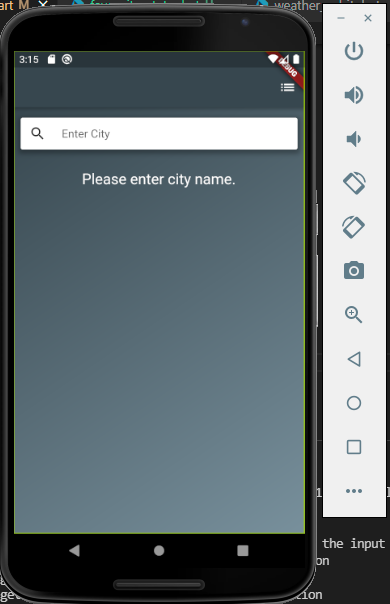
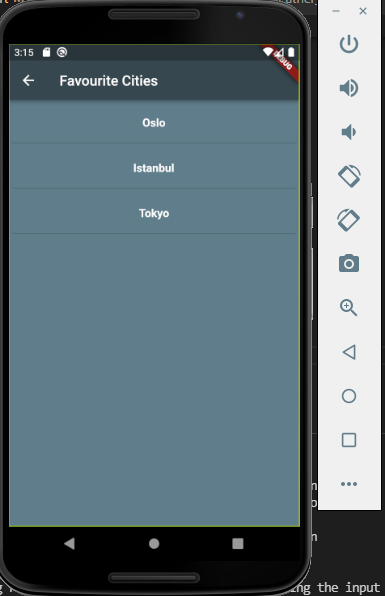
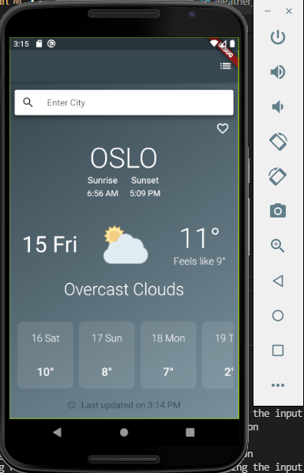
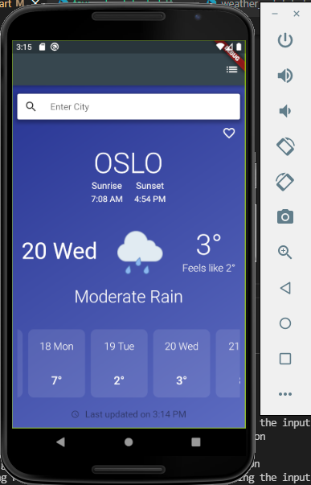
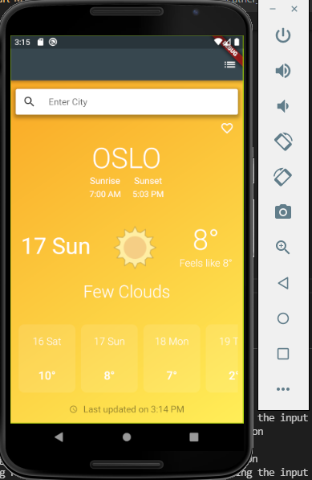
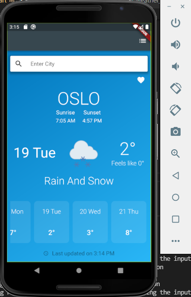

# Weather App

Block and Repository pattern is used for the this simple weather app.
You can add the cities to your favorites and see 7 days forecast and see the details.
I used Bloc(Cubit) pattern and Repository pattern
Because biggest advantages of using Cubit is simplicity. 
Also Repository pattern and dependency injection provides that
You don't depend on actual concrete classes you are dependent on interfaces 
With help of this, you can extend and test your classes easily
I completed the project according to these approaches

# 3rd Packages
    - http:  Http Client
    - flutter_bloc : for State Managment 
    - get_it :  for Dependecy injection
    - intl : for date/number formatting and parsing

# Pages
    - Home Page: Weather of City information
    - Favourite Page: Favourite Cities list 

# Environments
    I used Visual Studio Code 1.60.1
    Flutter 2.5.0 • channel stable 
    Dart 2.14.0

# How to run

    First, Android Studio -> AVD Manager -> run select device

    Second, VS Code termial: flutter run -d 'device_name'
   
# Images

    <table>
        <tr>
            <td style="text-align: center">
                    
            </td>            
            <td style="text-align: center">
                    
            </td>                     
        </tr>
        <tr>
            <td style="text-align: center">
                    
            </td> 
             <td style="text-align: center">
                    
            </td>      
             <td style="text-align: center">
                    
            </td>      
             <td style="text-align: center">
                    
            </td>                                     
        </tr>
    </table>

